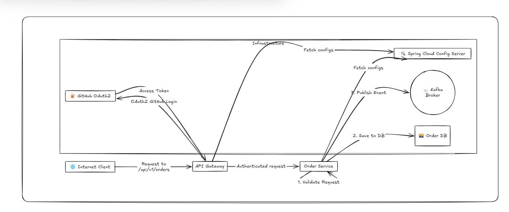

## 📦 Melita Order Taking API

A secure, scalable, event-driven microservice for capturing and processing customer orders submitted via 3rd-party systems (e.g., ERP). Supports products like Internet, TV, Telephony, and Mobile.

---
### Architecture



---

### 🚀 Features

* ✅ Public **RESTful API** to accept customer orders
* 🔐 **Oauth2-secured** endpoints for 3rd-party integrations
* ⚙️ Order validation, persistence, and event publishing
* 📨 **Kafka**-based asynchronous messaging to Fulfilment and Care systems
* ☁️ Externalized configuration via **Spring Cloud Config**
* 🧪 Robust unit and integration tests with **JUnit + Postman collections**

---

### 🧰 Tech Stack

| Layer             | Technology                         |
| ----------------- | ---------------------------------- |
| Framework         | Spring Boot (3.5.3)                |
| Messaging         | Kafka                              |
| Auth              | Spring Security + JWT              |
| Config Management | Spring Cloud Config                |
| Persistence       | Spring Data JPA + PostgreSQL.      |
| JSON Mapping      | Jackson (ObjectMapper)             |
| Testing           | JUnit 5 + Mockito + Postman        |
| Build Tool        | Maven / Gradle                     |

---

### 📑 API Overview

#### `POST /api/v1/orders`

* Create a new customer order.
* Publishes `OrderCreatedEvent` to Kafka after successful persistence.

#### `GET /api/v1/orders/{id}`

* Fetch a previously created order by ID.

> 📌 All endpoints require a valid **Bearer token**.

---

### 🧾 Sample Request Payload

```json
{
  "messageId": "abc123",
  "data": {
    "customer": {
      "firstName": "Jane",
      "lastName": "Doe",
      "email": "jane.doe@example.com",
      "phone": "+35698765432"
    },
    "installationAddress": {
      "street": "123 Main Street",
      "city": "Valletta",
      "postalCode": "VLT1111"
    },
    "installationSlot": {
      "date": "2025-07-01",
      "timeSlot": "10:00-12:00"
    },
    "products": [
      {
        "productType": "Internet",
        "packageName": "1Gbps"
      },
      {
        "productType": "TV",
        "packageName": "140 Channels"
      }
    ]
  }
}
```

---

### 🧪 Testing

#### ✅ Run Unit Tests

```bash
./mvnw test
```

#### ✅ Postman Collection

A Postman collection is included under:

```
postman/Melita Order Service.postman_collection.json
```

---

### ⚙️ Configuration

Configuration is externalized to a Spring Cloud Config Server. Example configuration keys:

```yaml
spring:
  kafka:
    bootstrap-servers: localhost:9092
    order-topic: melita.orders.created
  datasource:
    url: jdbc:postgresql://localhost:5432/orders
    username: user
    password: pass
```

---

### 📦 Build & Run

#### 🔨 Build

```bash
./mvnw clean install
```

#### ▶️ Run

```bash
./mvnw spring-boot:run
```

---

### 👤 Author

**Paul Odhiambo**
